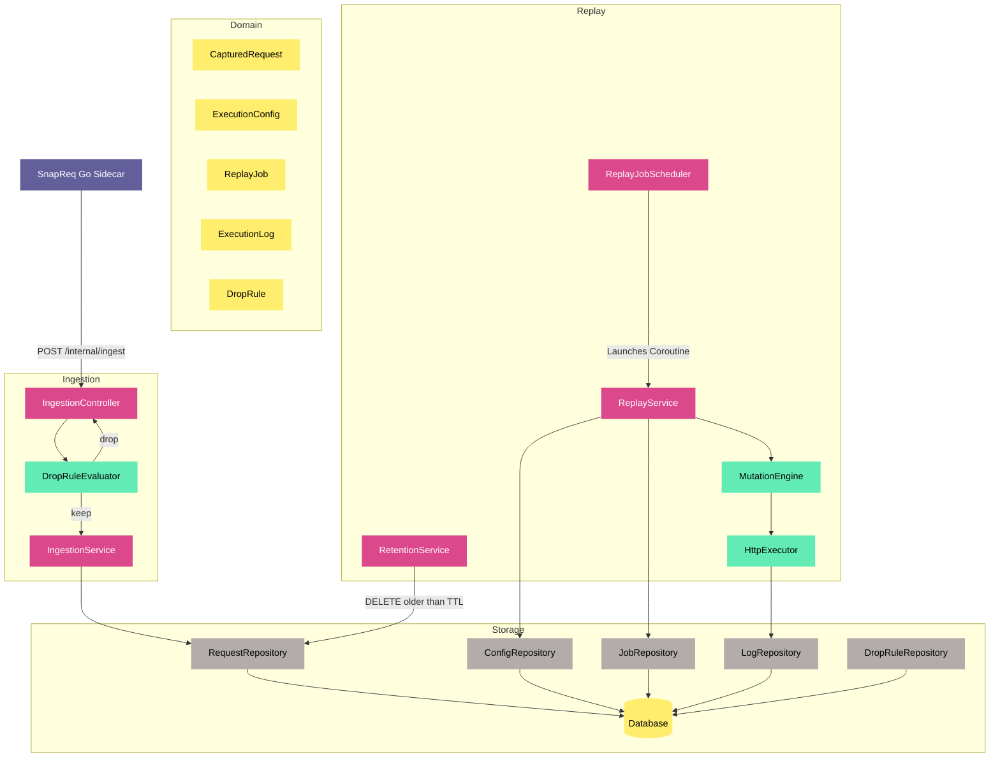

# Agent Rules — EchoChamber Engine

EchoChamber is the storage and replay engine (Part 2 of the SnapReq + EchoChamber system).  
It receives captured HTTP requests from SnapReq, stores them immutably, and lets you replay them against any target with optional mutation.

Read this file fully before writing any code. Apply every rule on every task.

**Task tracking:** All tasks are tracked via the GitHub project board at [https://github.com/users/th-lange/projects/1](https://github.com/users/th-lange/projects/1).

**Development environment:** All development work should be containerized using Docker. Use Docker Compose for local development to spin up PostgreSQL, the Spring Boot application, and any other dependencies as containers.

---

## 1. Architectural Layer Rules

The project follows strict DDD / clean architecture. Layer boundaries are hard.

```
domain/          ← no framework imports. Pure Kotlin. val-only data classes.
  model/         ← immutable domain entities
  port/          ← interfaces only (StorageAdapter, MutationHandler, HttpExecutor)

application/     ← orchestration. May import domain. No web/persistence imports.

adapter/         ← implements domain ports. May import Spring, JPA, R2DBC, WebClient.
  persistence/
  http/
  mutation/

web/             ← Spring controllers and DTOs only. Calls application services.
```

**Rules:**
- `domain/` must never import Spring, JPA, Reactor, or any framework class.
- `application/` must never import `javax.persistence`, `org.springframework.web`, or any adapter class directly.
- `web/` must never call repositories or adapters directly — only application services.
- DTOs live in `web/`. Domain models never leave `application/` or `adapter/` boundaries as HTTP responses — always map to a DTO first.

---

## 2. Immutability Rules

- `CapturedRequest` is a Kotlin `data class` with all `val` properties. It must never be modified after creation.
- The `StorageAdapter` interface must never expose an `updateRequest` or `deleteRequest` method.
- The JPA entity for `captured_requests` must never have `UPDATE` or `DELETE` calls in any repository method.
- The `MutationEngine` always copies a `CapturedRequest` into a `MutableRequest` before applying handlers. The original is never touched.
- **The only exception to deletion of `captured_requests` is TTL expiry**, handled exclusively by the scheduled retention task (§10). No other code path may delete captured requests.

---

## 3. Extensibility Rules

Every component that may vary must be hidden behind an interface in `domain/port/`:
- **Storage:** `StorageAdapter` — new backends implement this interface.
- **Mutation:** `MutationHandler` — new rules implement this interface and declare an `order(): Int`.
- **HTTP:** `HttpExecutor` — new transports implement this interface.

Never write logic that depends on a concrete adapter class. Depend only on the port interface.

---

## 4. Ingest Contract (Shared with SnapReq)

The `POST /internal/ingest` endpoint accepts the following JSON payload. This schema is the **shared contract** between SnapReq and EchoChamber. Any change to either side requires a simultaneous change to the other.

```json
{
  "method":    "GET",
  "uri":       "https://example.com/api/resource?q=1",
  "authority": "example.com",
  "headers":   { "accept": "application/json" },
  "body":      null
}
```

**Rules:**
- `capturedAt` is **stamped by EchoChamber on receipt** — SnapReq does not send a timestamp.
- `body` is `null` (not omitted, not empty string) when there is no body.
- `headers` is a flat `Map<String, String>` — single value per header name.
- The ingest endpoint must be idempotent on the same `(method, uri, authority, capturedAt)` tuple within a 1-second window — SnapReq may send duplicates if the caller retries.
- Ingest always returns `202 Accepted`. It does not return different statuses for dropped vs. stored requests. SnapReq does not wait for a response.

---

## 5. Drop Rules

Drop rules allow EchoChamber to silently discard captured requests **before persistence**. They are evaluated at the ingest endpoint, after auth but before any write.

### 5.1 Domain model

```kotlin
data class DropRule(
    val id: UUID,
    val name: String,
    val enabled: Boolean,
    val priority: Int,                        // lower = evaluated first
    val action: DropAction,                   // DROP or KEEP (KEEP short-circuits remaining rules)
    val methodPattern: String?,               // null = match any; exact match e.g. "GET"
    val pathPattern: String?,                 // null = match any; regex
    val authorityPattern: String?,            // null = match any; regex
    val headerMatches: Map<String, String>,   // all entries must match (regex values)
    val createdAt: Instant,
    val updatedAt: Instant
)

enum class DropAction { DROP, KEEP }
```

### 5.2 Evaluation rules

1. Rules are sorted by `priority` ascending, then `createdAt` ascending as a tiebreaker.
2. Only `enabled = true` rules are evaluated.
3. A rule matches if **all** non-null conditions match (AND logic within a rule).
4. The first matching rule's `action` is applied:
   - `DROP`: discard the request, return `202` to SnapReq, log at `debug`.
   - `KEEP`: persist the request immediately, skip remaining rules.
5. If **no rule matches**, the request is **persisted** (default-allow).
6. `pathPattern` and `authorityPattern` are evaluated as Java `Regex`. Invalid regex in a stored rule is logged at `error` and the rule is skipped (never crashes ingest).
7. `headerMatches` values are regex patterns matched against the header value. The header key is an exact case-insensitive match.

### 5.3 Storage

Drop rules are stored in a `drop_rules` table (Flyway migration). Exposed via Spring Data REST at `GET/POST/PUT/DELETE /api/dropRules`. Full CRUD — same pattern as `ExecutionConfig`.

### 5.4 Caching

Drop rules are read from DB and cached in memory. Cache is invalidated on any write to `drop_rules` (use Spring's `@CacheEvict` or a simple `@EventListener` on the repository). TTL on cache: 60 seconds as a safety net. Never query the DB per-request on the ingest hot path.

---

## 6. Retention (TTL)

Captured requests older than the configured TTL are deleted on a schedule. This is the **only** code path that may delete rows from `captured_requests`.

### 6.1 Configuration

| Property | Env var | Default | Description |
|---|---|---|---|
| `echochamber.retention.ttl-days` | `RETENTION_TTL_DAYS` | `14` | Days to keep captured requests |
| `echochamber.retention.cron` | `RETENTION_CRON` | `0 3 * * *` (03:00 daily) | Cron expression for the cleanup task |
| `echochamber.retention.enabled` | `RETENTION_ENABLED` | `true` | Set to `false` to disable entirely |

### 6.2 Implementation

- A single `@Scheduled` method in `application/RetentionService` calls `StorageAdapter.deleteRequestsOlderThan(cutoff: Instant)`.
- `StorageAdapter` gains one new method: `suspend fun deleteRequestsOlderThan(cutoff: Instant): Long` (returns count deleted).
- The JPA implementation executes `DELETE FROM captured_requests WHERE captured_at < :cutoff` via a `@Modifying @Query` on the repository.
- Log deleted count at `info` level after each run.
- This is the **only** place `DELETE` is permitted on `captured_requests`.
- Retention runs do not affect `execution_logs` (logs are valuable for audit). Add a separate `EXECUTION_LOG_TTL_DAYS` in a future ticket if needed.

### 6.3 Schema

Add `captured_at` index if not present (already in V1 migration — verify before adding).

---

## 7. Test Requirements

Every ticket requires tests. No ticket is complete without them.

| Layer | Required test type |
|---|---|
| Domain model | Unit test — construction, immutability, equality |
| Port interface | Contract test — verify any implementation satisfies the interface contract |
| Application service | Unit test with mocked ports |
| Adapter (JPA/R2DBC) | Integration test against a real test database (Testcontainers) |
| Adapter (mutation handlers) | Unit test per handler |
| `ScriptMutationHandler` | Unit tests for: valid script, script that throws, sandbox escape attempt, CPU timeout |
| `InternalAuthFilter` | Unit test for: valid token, missing token, wrong token |
| Web controller | Integration test using `@SpringBootTest` and `MockMvc` / `WebTestClient` |
| Ingestion endpoint | Valid payload persisted; invalid payload rejected; auth rejected |
| Ingestion endpoint — drop rules | Rule matches → 202 + not persisted; rule disabled → persisted; KEEP short-circuits; no rule → persisted |
| Drop rule CRUD | Full round-trip via Spring Data REST; cache invalidated on write |
| Replay trigger | Job created, `202` returned, job progresses asynchronously |
| `RetentionService` | Unit: cutoff calculated correctly; `deleteRequestsOlderThan` called with correct instant |
| Retention integration | Testcontainers: insert rows at various ages, run retention, verify correct rows deleted |

**Never mock the database in integration tests.** Use Testcontainers with a real PostgreSQL instance.

---

## 8. Security Rules

- `INTERNAL_INGEST_TOKEN` must never be hardcoded. Always read from environment variable.
- `InternalAuthFilter` must reject with `401` on missing or mismatched token before any controller logic runs on `/internal/**` paths.
- `ScriptMutationHandler` must build its GraalVM `Context` with `allowAllAccess(false)` and no host class access. Scripts must run with a CPU time limit (suggest 2s). Any script that exceeds the limit or throws must log and surface a `FAILURE` status — never crash the replay job.
- Never log full request bodies at INFO level — use DEBUG, and gate behind a feature flag if bodies may contain PII.
- Drop rule regex patterns are compiled at cache-load time, not per-request. Catch `PatternSyntaxException` at load time.

---

## 9. Coroutine & Concurrency Rules

- `ReplayService` executes replays inside a Kotlin coroutine `Semaphore` bounded by `ExecutionConfig.maxConcurrency`.
- Rate limiting is enforced per `ExecutionConfig.rateLimitPerSecond`. Use Resilience4j or a coroutine-native token bucket — not `Thread.sleep`.
- JPA adapter work must be dispatched to `Dispatchers.IO`. Never block a coroutine dispatcher thread with blocking JDBC calls on the default dispatcher.
- R2DBC adapter must use coroutine extensions (`Flow`, `suspend fun`) — never block on `Mono`/`Flux` with `.block()`.
- Drop rule evaluation is synchronous and in-memory (cache). It must not suspend or touch IO.

---

## 10. Database Rules

- All schema changes go through Flyway migrations. Never use `spring.jpa.hibernate.ddl-auto=update` in any environment.
- Migrations are numbered sequentially: `V1__init.sql`, `V2__add_drop_rules.sql`, etc.
- The DB role used by the engine at runtime must have `INSERT + SELECT` on `captured_requests` — plus `DELETE` only for the retention service's DB user / via a dedicated query method. Consider a separate DB role or RLS policy for this if the environment supports it.
- `drop_rules` table is fully mutable (INSERT, UPDATE, DELETE permitted).

---

## 11. GitHub Ticket Workflow

All work must be tracked on the GitHub project board.

- **Before starting work** on a ticket, move it to **"In Progress"** on the project board.
- **When the implementation is complete**, open a Pull Request with a clear, concise title and description that references the ticket (e.g. `Closes #<issue-number>`). Move the ticket to **"In Review"**.
- The PR description must summarise: what was changed, why, and any relevant implementation decisions.
- A ticket must never remain in "Todo" while actively being worked on, and must never stay in "In Progress" after a PR has been opened.

### 11.1 Definition of Done — Mandatory after every task

Every time a unit of work is finished, the agent **must**, without being asked:

1. **Self-evaluate** against the ticket's Acceptance Criteria and the §12 Self-Correction Checklist.
2. **Run the relevant tests** (`./gradlew test` or a scoped subset) and confirm they pass. Pre-existing, unrelated failures must be called out explicitly, not silently ignored.
3. **Verify layer purity** — no framework imports leaked into `domain/`, no adapter/web imports leaked into `application/`.
4. **If the work is ready**, open a Pull Request immediately via `gh pr create` against `main`, with `Closes #<issue-number>` in the body. Do not wait for the user to ask.
5. **If the work is not ready**, state precisely what is missing and what the next step is before stopping.
6. **Report PR URL and evaluation summary** back to the user in the same response.

This rule applies to every ticket, refactor, bugfix, or chore — no exceptions.

---

## 12. Self-Correction Checklist

Run this checklist mentally before marking any implementation complete:

- [ ] Does `domain/` import any framework class? → **Remove it.**
- [ ] Does `application/` import any adapter or web class? → **Remove it.**
- [ ] Does any code call a concrete adapter directly instead of its port interface? → **Fix it.**
- [ ] Is `CapturedRequest` mutated anywhere after construction? → **Fix it.**
- [ ] Does `StorageAdapter` expose update/delete for requests (other than `deleteRequestsOlderThan`)? → **Remove it.**
- [ ] Is there a test for every public method in every service? → **Add missing tests.**
- [ ] Does the JPA integration test use Testcontainers (not H2)? → **Fix it if not.**
- [ ] Is `INTERNAL_INGEST_TOKEN` read from env? → **Fix it if hardcoded.**
- [ ] Is the GraalVM context sandboxed? → **Verify `allowAllAccess(false)`.**
- [ ] Is the Flyway migration present for every schema change? → **Add it if missing.**
- [ ] Are domain models leaking into HTTP responses? → **Map to DTOs.**
- [ ] Are drop rules evaluated from cache, not DB, on the ingest hot path? → **Verify.**
- [ ] Does the ingest endpoint return `202` regardless of drop/store outcome? → **Verify.**
- [ ] Does `RetentionService` have the only `DELETE` path on `captured_requests`? → **Verify.**
- [ ] Are drop rule regex patterns compiled at cache-load time with error handling? → **Verify.**

---

## 13. Diagrams

All architecture and design diagrams in this project are written in **Mermaid**. When creating or updating diagrams, follow the style conventions below so all diagrams remain visually consistent.

### 13.1 Colour palette

| Role | Fill | Stroke | Text |
|---|---|---|---|
| External system / sidecar | `#625F9B` | `none` | `#FFF` |
| Service / controller / application layer | `#DB488B` | `none` | `#FFF` |
| Utility / engine component | `#63EBB6` | `none` | `#000` |
| Domain model / data entity | `#FFED6E` | `none` | `#000` |
| Repository / storage adapter | `#B2ACAB` | `none` | `#000` |
| Database node | `#FFED6E` | `none` | `#000` |

Apply colours via `style <NodeId> fill:<hex>,stroke:none,color:<hex>`.

### 13.2 Diagram types in use

| Diagram | Purpose |
|---|---|
| `graph TD` | High-level component and data-flow overview |
| `erDiagram` | Database schema and table relationships |
| `sequenceDiagram` | Async request/replay lifecycle |
| `classDiagram` | Domain port interfaces and their implementations |

### 13.3 Style rules

- Always set `stroke:none` — no border on any node.
- Use the palette above; do not introduce ad-hoc colours.
- Subgraphs group nodes by architectural layer.
- `sequenceDiagram` participants follow the call order left-to-right.
- `classDiagram` marks interfaces with `<<interface>>`.
- Every diagram must have a prose heading that explains what it shows.

### 13.4 Architecture diagram



---

## 14. What Not To Do

- Do not add `UPDATE` or `DELETE` operations on `captured_requests` for any reason other than TTL retention.
- Do not add HTTP endpoints that were not specified in the implementation plan without discussing first.
- Do not use `Thread.sleep` for rate limiting.
- Do not use `@Suppress` annotations to silence layer-boundary violations.
- Do not call `.block()` on any `Mono` or `Flux` inside a coroutine context.
- Do not add Swagger/OpenAPI unless explicitly requested — Spring Data REST with HAL Explorer is sufficient.
- Do not bypass `InternalAuthFilter` by adding a security permit-all rule on `/internal/**`.
- Do not query the `drop_rules` table per ingest request — use the cache.
- Do not return different HTTP status codes from `/internal/ingest` based on drop/store outcome. Always `202`.
- Do not apply drop rules to replay executions — only to ingest.

---

## 15. Self-Update Rules (Meta)

This file is a living document. The agent maintaining this codebase **must** follow these rules about updating it:

**Add freely:** When a pattern, constraint, or decision is discovered during implementation that would prevent future mistakes or clarify intent, add it to the relevant section without asking. New sections may be added. Examples: a Spring behaviour quirk discovered during testing, a Flyway constraint, a JPA caching edge case.

**Propose before removing or changing existing rules:** If an existing rule appears outdated, incorrect, or in conflict with a new finding, do **not** silently delete or change it. Instead, append a clearly marked proposal block at the end of the file:

```
## PROPOSED CHANGE — <date>
**Rule affected:** §N <rule name>
**Reason:** <what was discovered>
**Proposed change:** <exact new wording or deletion>
**Awaiting human approval.**
```

Leave the original rule intact until a human explicitly approves the change.

**Never propose changes to §1 (Layer Rules), §2 (Immutability), or §14 (What Not To Do) without an exceptional justification.** These are load-bearing constraints.
