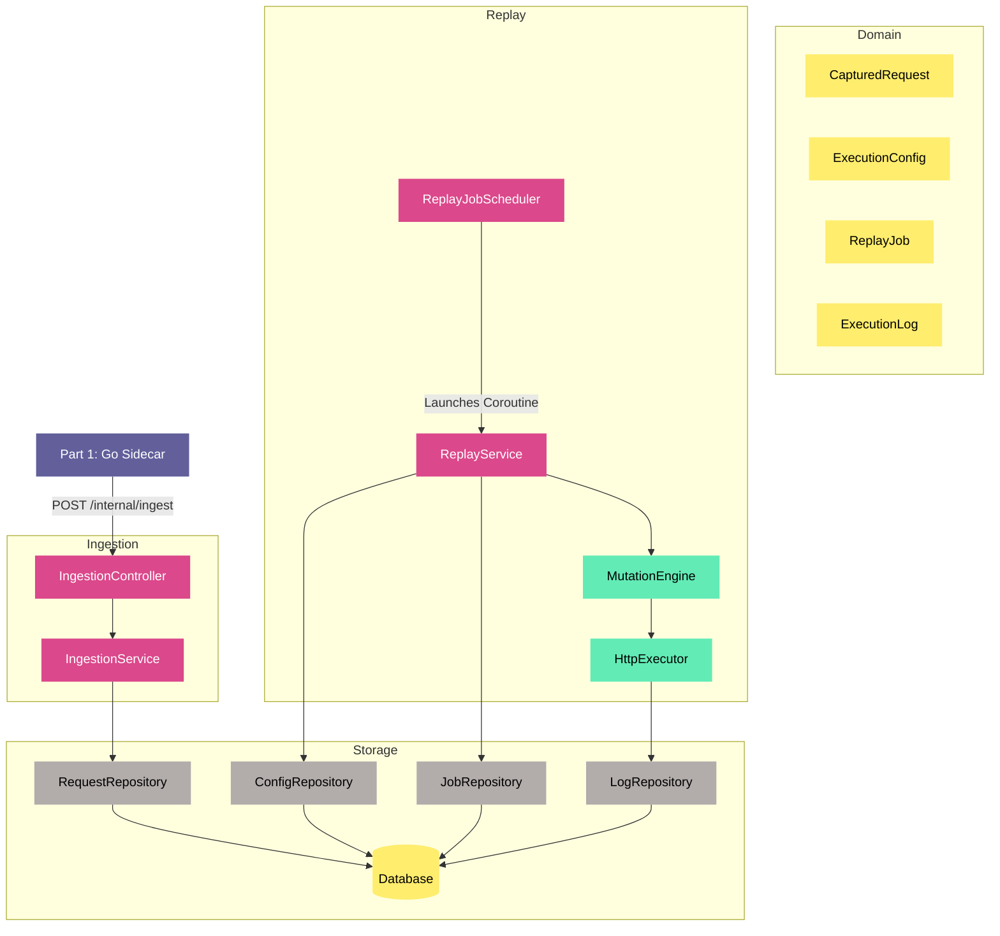

# Agent Rules — EchoChamber Engine

This file governs all implementation work on the Part 2 engine (Kotlin / Spring Boot).  
Read it fully before writing any code. Apply every rule on every task.

**Task tracking:** All tasks are tracked via the GitHub project board at [https://github.com/users/th-lange/projects/1](https://github.com/users/th-lange/projects/1).

**Development environment:** All development work should be containerized using Docker. Use Docker Compose for local development to spin up PostgreSQL, the Spring Boot application, and any other dependencies as containers.

---

## 1. Architectural Layer Rules

The project follows strict DDD / clean architecture. Layer boundaries are hard.

```
domain/          ← no framework imports. Pure Kotlin. val-only data classes.
  model/         ← immutable domain entities
  port/          ← interfaces only (StorageAdapter, MutationHandler, HttpExecutor)

application/     ← orchestration. May import domain. No web/persistence imports.

adapter/         ← implements domain ports. May import Spring, JPA, R2DBC, WebClient.
  persistence/
  http/
  mutation/

web/             ← Spring controllers and DTOs only. Calls application services.
```

**Rules:**
- `domain/` must never import Spring, JPA, Reactor, or any framework class.
- `application/` must never import `javax.persistence`, `org.springframework.web`, or any adapter class directly.
- `web/` must never call repositories or adapters directly — only application services.
- DTOs live in `web/`. Domain models never leave `application/` or `adapter/` boundaries as HTTP responses — always map to a DTO first.

---

## 2. Immutability Rules

- `CapturedRequest` is a Kotlin `data class` with all `val` properties. It must never be modified after creation.
- The `StorageAdapter` interface must never expose an `updateRequest` or `deleteRequest` method.
- The JPA entity for `captured_requests` must never have `UPDATE` or `DELETE` calls in any repository method.
- The `MutationEngine` always copies a `CapturedRequest` into a `MutableRequest` before applying handlers. The original is never touched.

---

## 3. Extensibility Rules

Every component that may vary must be hidden behind an interface in `domain/port/`:
- **Storage:** `StorageAdapter` — new backends implement this interface.
- **Mutation:** `MutationHandler` — new rules implement this interface and declare an `order(): Int`.
- **HTTP:** `HttpExecutor` — new transports implement this interface.

Never write logic that depends on a concrete adapter class. Depend only on the port interface.

---

## 4. Test Requirements

Every ticket requires tests. No ticket is complete without them.

| Layer | Required test type |
|---|---|
| Domain model | Unit test — construction, immutability, equality |
| Port interface | Contract test — verify any implementation satisfies the interface contract |
| Application service | Unit test with mocked ports |
| Adapter (JPA/R2DBC) | Integration test against a real test database (Testcontainers) |
| Adapter (mutation handlers) | Unit test per handler |
| `ScriptMutationHandler` | Unit tests for: valid script, script that throws, sandbox escape attempt, CPU timeout |
| `InternalAuthFilter` | Unit test for: valid token, missing token, wrong token |
| Web controller | Integration test using `@SpringBootTest` and `MockMvc` / `WebTestClient` |
| Ingestion endpoint | Test: valid payload persisted, invalid payload rejected, auth rejected |
| Replay trigger | Test: job created, 202 returned, job progresses asynchronously |

**Never mock the database in integration tests.** Use Testcontainers with a real PostgreSQL instance.

---

## 5. Security Rules

- `INTERNAL_INGEST_TOKEN` must never be hardcoded. Always read from environment variable.
- `InternalAuthFilter` must reject with `401` on missing or mismatched token before any controller logic runs.
- `ScriptMutationHandler` must build its GraalVM `Context` with `allowAllAccess(false)` and no host class access. Scripts must run with a CPU time limit (suggest 2s). Any script that exceeds the limit or throws must log and surface a `FAILURE` status — never crash the replay job.
- Never log full request bodies at INFO level — use DEBUG, and gate behind a feature flag if bodies may contain PII.

---

## 6. Coroutine & Concurrency Rules

- `ReplayService` executes replays inside a Kotlin coroutine `Semaphore` bounded by `ExecutionConfig.maxConcurrency`.
- Rate limiting is enforced per `ExecutionConfig.rateLimitPerSecond`. Use Resilience4j or a coroutine-native token bucket — not `Thread.sleep`.
- JPA adapter work must be dispatched to `Dispatchers.IO`. Never block a coroutine dispatcher thread with blocking JDBC calls on the default dispatcher.
- R2DBC adapter must use coroutine extensions (`Flow`, `suspend fun`) — never block on `Mono`/`Flux` with `.block()`.

---

## 7. Database Rules

- All schema changes go through Flyway migrations. Never use `spring.jpa.hibernate.ddl-auto=update` in any environment.
- Migrations are numbered sequentially: `V1__init.sql`, `V2__add_mutation_script.sql`, etc.
- The DB role used by the engine at runtime must have `INSERT + SELECT` on `captured_requests` only — no `UPDATE` or `DELETE`.

---

## 8. Self-Correction Checklist

Run this checklist mentally before marking any implementation complete:

- [ ] Does `domain/` import any framework class? → **Remove it.**
- [ ] Does `application/` import any adapter or web class? → **Remove it.**
- [ ] Does any code call a concrete adapter directly instead of its port interface? → **Fix it.**
- [ ] Is `CapturedRequest` mutated anywhere after construction? → **Fix it.**
- [ ] Does `StorageAdapter` expose update/delete for requests? → **Remove it.**
- [ ] Is there a test for every public method in every service? → **Add missing tests.**
- [ ] Does the JPA integration test use Testcontainers (not H2)? → **Fix it if not.**
- [ ] Is `INTERNAL_INGEST_TOKEN` read from env? → **Fix it if hardcoded.**
- [ ] Is the GraalVM context sandboxed? → **Verify `allowAllAccess(false)`.**
- [ ] Is the Flyway migration present for every schema change? → **Add it if missing.**
- [ ] Are domain models leaking into HTTP responses? → **Map to DTOs.**

If any box cannot be checked, fix the issue before considering the work done.

---

## 9. Diagrams

All architecture and design diagrams in this project are written in **Mermaid**. When creating or updating diagrams, follow the style conventions below so all diagrams remain visually consistent.

### 9.1 Colour palette

| Role | Fill | Stroke | Text |
|---|---|---|---|
| External system / sidecar | `#625F9B` | `none` | `#FFF` |
| Service / controller / application layer | `#DB488B` | `none` | `#FFF` |
| Utility / engine component | `#63EBB6` | `none` | `#000` |
| Domain model / data entity | `#FFED6E` | `none` | `#000` |
| Repository / storage adapter | `#B2ACAB` | `none` | `#000` |
| Database node | `#FFED6E` | `none` | `#000` |

Apply colours via `style <NodeId> fill:<hex>,stroke:none,color:<hex>`.
Architecture
### 9.2 Diagram types in use

| Diagram | Purpose |
|---|---|
| `graph TD` | High-level component and data-flow overview |
| `erDiagram` | Database schema and table relationships |
| `sequenceDiagram` | Async request/replay lifecycle |
| `classDiagram` | Domain port interfaces and their implementations |

### 9.3 Style rules

- Always set `stroke:none` — no border on any node.
- Use the palette above; do not introduce ad-hoc colours.
- Subgraphs group nodes by architectural layer (`Ingestion`, `Domain`, `Replay`, `Storage`).
- `sequenceDiagram` participants follow the call order left-to-right.
- `classDiagram` marks interfaces with `<<interface>>`.
- Every diagram must have a prose heading that explains what it shows.

### 9.4 Architecture diagram



---

## 10. What Not To Do

- Do not add `UPDATE` or `DELETE` operations on `captured_requests` for any reason.
- Do not add HTTP endpoints that were not specified in the implementation plan without discussing first.
- Do not use `Thread.sleep` for rate limiting.
- Do not use `@Suppress` annotations to silence layer-boundary violations.
- Do not call `.block()` on any `Mono` or `Flux` inside a coroutine context.
- Do not add Swagger/OpenAPI unless explicitly requested — Spring Data REST with HAL Explorer is sufficient.
- Do not bypass `InternalAuthFilter` by adding a security permit-all rule on `/internal/**`.
