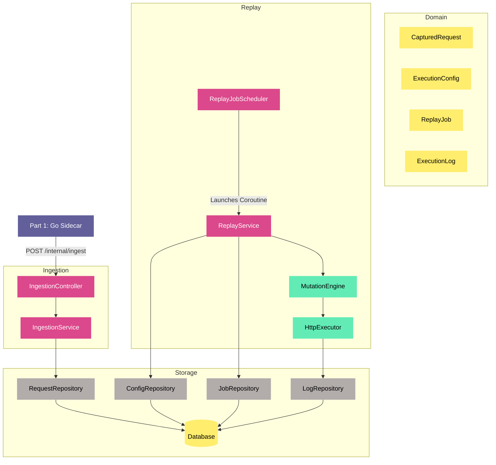

# EchoChamber

A **Kotlin / Spring Boot** HTTP request capture-and-replay engine. EchoChamber is Part 2 of a two-part system: a Go sidecar (Part 1) captures live HTTP traffic and forwards it here; EchoChamber stores those requests immutably and lets you replay them against any target, optionally mutating headers, URLs, body placeholders, or running arbitrary JavaScript transforms via a sandboxed GraalVM engine.

---

## Why it exists

Testing against real production traffic is fundamentally different from synthetic load tests or hand-crafted fixtures — real requests expose edge cases, auth flows, and payload shapes that are hard to replicate artificially.

EchoChamber was built to close that gap. A lightweight Go sidecar (Part 1) sits in-path of live ingress traffic and captures every request without adding latency to the hot path. EchoChamber (Part 2) stores those captures immutably and turns them into a replayable library. When you need to validate a new service version, test a migration, reproduce a production bug, or run a realistic load test, you trigger a replay job — pointing the same real traffic at a different target, mutated however you need: different base URL, swapped headers, substituted user IDs, or a full custom JavaScript transform to recompute signatures or derived fields.

The core problems it solves:

- **Regression testing with production fidelity** — replay the actual requests that hit your service yesterday against the new version today.
- **Environment migration validation** — redirect captured traffic to a staging or shadow environment to verify behaviour before cutting over.
- **Incident reproduction** — any captured request can be replayed in isolation, with mutations, to reproduce and diagnose a production failure.
- **Controlled load testing** — replay at configurable concurrency and rate limits using traffic that reflects real usage patterns, not synthetic scripts.

---

## What it does

| Capability | Detail |
|---|---|
| **Ingestion** | Receives captured HTTP requests from the Go sidecar over a secured internal endpoint and stores them in an append-only PostgreSQL table |
| **Mutation** | Transforms a captured request before replay using an ordered chain of handlers — header overrides, base-URL swap, placeholder substitution, or a custom JS script |
| **Replay** | Asynchronously re-fires captured requests against a configured target, with concurrency control and per-second rate limiting |
| **Execution tracking** | Records every individual execution (status, response code, latency, headers, body) and tracks overall job progress |
| **Admin UI** | Spring Data REST + HAL Explorer provides a zero-code CRUD interface for browsing captures, managing execution configs, and monitoring jobs |

---

## Getting started

### Prerequisites

- [Docker](https://docs.docker.com/get-docker/) and Docker Compose
- JDK 21+ (only needed if running outside Docker)

### 1. Configure environment

```bash
cp .env.example .env
```

Edit `.env` and set a strong value for `INTERNAL_INGEST_TOKEN`. The database defaults (`localhost:5432`, db/user/password all `echochamber`) work out of the box with Docker Compose.

### 2. Start with Docker Compose

```bash
docker compose up --build
```

This starts:
- **PostgreSQL 15** on `localhost:5432`
- **EchoChamber** on `http://localhost:8080`

### 3. Run locally (without Docker)

Start only the database, then run the app via Gradle:

```bash
docker compose up -d postgres
./gradlew bootRun
```

### Key endpoints

| URL | Description |
|---|---|
| `http://localhost:8080/swagger-ui.html` | Swagger UI — interactive API docs |
| `http://localhost:8080/v3/api-docs` | OpenAPI JSON spec |
| `http://localhost:8080/api/explorer` | HAL Explorer — browse all Spring Data REST resources |
| `http://localhost:8080/api/capturedRequests` | Browse captured requests |
| `http://localhost:8080/api/executionConfigs` | Manage replay configs |
| `http://localhost:8080/api/replayJobs` | Browse replay jobs |
| `http://localhost:8080/internal/ingest` | Ingestion endpoint (requires Bearer token) |

### Trigger a replay job (example)

```bash
curl -X POST http://localhost:8080/api/replayJobs/trigger \
  -H "Content-Type: application/json" \
  -d '{"executionConfigId": 1}'
```

### Ingest a captured request (example)

```bash
curl -X POST http://localhost:8080/internal/ingest \
  -H "Authorization: Bearer <INTERNAL_INGEST_TOKEN>" \
  -H "Content-Type: application/json" \
  -d '{
    "method": "GET",
    "uri": "https://example.com/api/resource",
    "headers": {"Accept": "application/json"},
    "body": null
  }'
```

---

## Architecture

The project follows strict DDD / clean architecture. Layer boundaries are enforced by the [Agent.md](Agent.md) rules.



### Layer structure

```
domain/          ← pure Kotlin, no framework imports
  model/         ← immutable domain entities (val-only data classes)
  port/          ← interfaces: StorageAdapter, MutationHandler, HttpExecutor

application/     ← orchestration only; imports domain, nothing else
  IngestionService
  MutationEngine
  ReplayService
  ReplayJobScheduler

adapter/         ← implements domain ports; may import Spring, JPA, R2DBC, WebClient
  persistence/
    jpa/         ← JpaStorageAdapter (blocking work on Dispatchers.IO)
    r2dbc/       ← R2dbcStorageAdapter (reactive, coroutine extensions only)
  http/          ← WebClientHttpExecutor
  mutation/      ← HeaderOverride, BaseUrl, PlaceholderReplacement, Script handlers

web/             ← Spring controllers + DTOs only; calls application services
  filter/        ← InternalAuthFilter (Bearer token on /internal/**)
  ingestion/     ← POST /internal/ingest
  replay/        ← POST /api/replayJobs/trigger, POST /api/replayJobs/{id}/cancel
```

**Hard rules:**
- `domain/` never imports a framework class.
- `application/` never imports a web or persistence class.
- `web/` never calls a repository or adapter directly.
- Domain models never leave `application/` or `adapter/` as HTTP responses — always map to a DTO first.

---

## Domain model

### CapturedRequest
Immutable (`data class`, all `val`). Never updated or deleted after ingestion. The storage layer enforces `INSERT + SELECT` only.

### ExecutionConfig
A named replay template that defines:
- `baseUrlOverride` — swap the target host
- `headerOverrides` — add/replace headers
- `mutationParameters` — key/value map for placeholder substitution
- `mutationScript` — optional JavaScript run inside a sandboxed GraalVM context
- `maxConcurrency` — parallel request limit
- `rateLimitPerSecond` — token-bucket cap

### ReplayJob
Tracks a batch execution: status (`PENDING → RUNNING → COMPLETED / FAILED`), counts of total / processed / failed requests, timestamps.

### ExecutionLog
One record per individual execution: HTTP status, response time in ms, response headers and body, execution status (`SUCCESS / FAILURE / TIMEOUT`).

---

## Mutation pipeline

The `MutationEngine` runs an ordered chain of `MutationHandler` implementations. Each handler receives a `MutableRequest` copy — the original `CapturedRequest` is never touched.

| Handler | Order | What it does |
|---|---|---|
| `HeaderOverrideMutationHandler` | 10 | Adds or replaces headers from `ExecutionConfig.headerOverrides` |
| `BaseUrlMutationHandler` | 20 | Replaces the scheme + authority with `ExecutionConfig.baseUrlOverride` |
| `PlaceholderReplacementMutationHandler` | 30 | Substitutes `{{key}}` tokens in the URI and body using `mutationParameters` |
| `ScriptMutationHandler` | 100 | Runs `mutationScript` inside a GraalVM Polyglot JS context (`allowAllAccess(false)`, 2 s CPU limit) |

New mutation rules: implement `MutationHandler`, declare `@Component`, return the desired `order()` value.

---

## Replay execution

`ReplayService` drives the async execution loop:

1. Load `CapturedRequest` records matching the job's filter.
2. For each request, run the `MutationEngine` to produce a `MutableRequest`.
3. Fire the mutated request via `HttpExecutor` (Spring WebClient under the hood).
4. Persist an `ExecutionLog` with the result.
5. Update the `ReplayJob` progress counters.

Concurrency is bounded by a Kotlin `Semaphore(maxConcurrency)`. Rate limiting uses Resilience4j — not `Thread.sleep`. `ReplayJobScheduler` creates a `PENDING` job, then launches a background coroutine via `SupervisorJob` to run `ReplayService`.

---

## API surface

### Ingestion (internal)

| Method | Path | Auth | Description |
|---|---|---|---|
| `POST` | `/internal/ingest` | Bearer `INTERNAL_INGEST_TOKEN` | Accept a captured request from the Go sidecar |

### Spring Data REST (auto-exposed, HAL format)

| Path | Description |
|---|---|
| `GET /api/capturedRequests` | Browse captured requests (read-only) |
| `GET /api/executionConfigs` | List execution configs |
| `POST /api/executionConfigs` | Create a config |
| `PUT /api/executionConfigs/{id}` | Update a config |
| `DELETE /api/executionConfigs/{id}` | Delete a config |
| `GET /api/replayJobs` | Browse replay jobs (read-only) |
| `GET /api/executionLogs` | Browse execution logs (read-only) |
| `GET /api/explorer` | HAL Explorer UI |

### Action endpoints

| Method | Path | Description |
|---|---|---|
| `POST` | `/api/replayJobs/trigger` | Start an async replay job; returns `202 Accepted` |
| `POST` | `/api/replayJobs/{id}/cancel` | Abort a running job |

---

## Database schema

Four tables managed by Flyway (sequential migrations `V1__init.sql`, `V2__...`):

- **`captured_requests`** — append-only; DB role has `INSERT + SELECT` only.
- **`execution_configs`** — mutable replay templates.
- **`replay_jobs`** — batch job tracking.
- **`execution_logs`** — one row per individual HTTP execution.

`spring.jpa.hibernate.ddl-auto` is set to `validate` in all environments. Schema changes always go through a new Flyway migration file.

---

## Security

- `INTERNAL_INGEST_TOKEN` is read from an environment variable and never hardcoded.
- `InternalAuthFilter` validates the Bearer token and returns `401` before any controller logic runs on `/internal/**` paths.
- GraalVM Polyglot context is created with `allowAllAccess(false)` and no host class access. Scripts exceeding the 2 s CPU limit produce a `FAILURE` status; they never crash the replay job.
- Request bodies are never logged at `INFO` level — `DEBUG` only, gated behind a PII feature flag.

---

## Technology stack

| Concern | Choice |
|---|---|
| Language | Kotlin |
| Framework | Spring Boot |
| Persistence (blocking) | Spring Data JPA + PostgreSQL |
| Persistence (reactive) | Spring Data R2DBC |
| Schema migrations | Flyway |
| HTTP client | Spring WebClient |
| Concurrency | Kotlin Coroutines + `kotlinx-coroutines-reactor` |
| Rate limiting | Resilience4j |
| Scripting sandbox | GraalVM Polyglot (JS) |
| Admin UI | Spring Data REST + HAL Explorer |
| Integration tests | Testcontainers (real PostgreSQL, no H2) + WireMock |

---

## Testing requirements

Every layer has a required test type:

| Layer | Required test |
|---|---|
| Domain model | Unit — construction, immutability, equality |
| Port interface | Contract test — any implementation must satisfy the interface |
| Application service | Unit with mocked ports |
| JPA / R2DBC adapter | Integration test via Testcontainers (real PostgreSQL) |
| Mutation handlers | Unit test per handler |
| `ScriptMutationHandler` | Unit tests: valid script, script throws, sandbox escape, CPU timeout |
| `InternalAuthFilter` | Unit tests: valid token, missing token, wrong token |
| Controllers | `@SpringBootTest` + `MockMvc` / `WebTestClient` |
| Ingestion endpoint | Valid payload persisted; invalid payload rejected; auth rejected |
| Replay trigger | Job created, `202` returned, job progresses asynchronously |

Integration tests must use Testcontainers — never mock the database.

---

## Governance

All coding standards, layer rules, security guardrails, and a self-correction checklist are defined in [Agent.md](Agent.md). 
Read it before writing any code.
