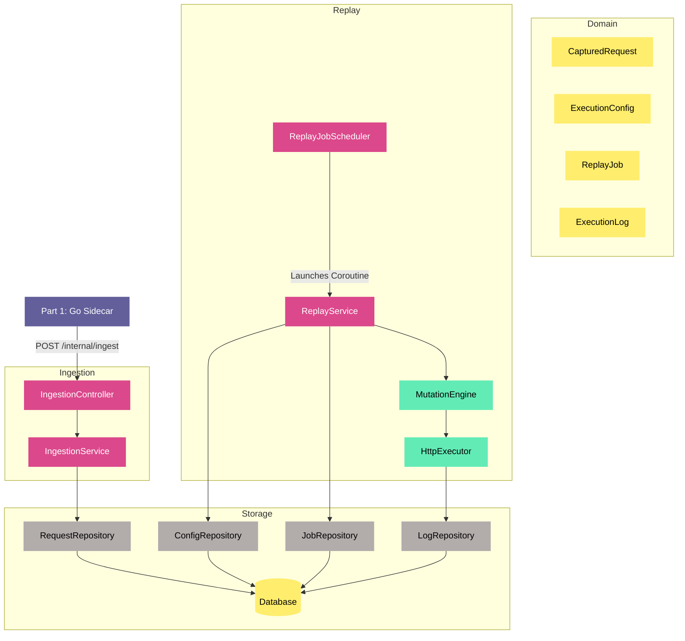

# Architecture

EchoChamber follows strict DDD / clean architecture. Layer boundaries are hard and are
enforced by the rules in [../Agent.md](../Agent.md).

## Component & data flow



## Layer structure

```
domain/          ← pure Kotlin, no framework imports
  model/         ← immutable domain entities (val-only data classes)
  port/          ← interfaces: StorageAdapter, MutationHandler, HttpExecutor,
                   UserStore, AuditStore, PasswordHasher
  mutation/      ← pure helpers: RequestOverrideApplier, BodyPatch

application/     ← orchestration only; imports domain, nothing else
  IngestionService
  MutationEngine
  ReplayService
  ReplayJobScheduler
  UserService          ← create/disable/role/password, last-active-admin guard
  AuditService         ← best-effort audit writes
  ConsoleService       ← read-side queries for the console
  BootstrapAdminInitializer

adapter/         ← implements domain ports; may import Spring, JPA, WebClient
  persistence/
    jpa/         ← JpaStorageAdapter, JpaUserStore, JpaAuditStore (blocking on Dispatchers.IO)
  http/          ← WebClientHttpExecutor
  mutation/      ← HeaderOverride, BaseUrl, PlaceholderReplacement handlers
  security/      ← BCryptPasswordHasher

web/             ← Spring controllers + DTOs only; calls application services
  filter/        ← InternalAuthFilter (Bearer token on /internal/**)
  security/      ← SecurityConfig (two chains), DbUserDetailsService
  ingestion/     ← POST /internal/ingest
  replay/        ← POST /api/replayJobs/trigger, POST /api/replayJobs/{id}/cancel
  user/          ← /api/users (ADMIN-only)
  console/       ← server-rendered /admin console (Thymeleaf)
```

## Hard rules

- `domain/` never imports a framework class.
- `application/` never imports a web or persistence class.
- `web/` never calls a repository or adapter directly — only application services.
- Domain models never leave `application/` or `adapter/` as HTTP responses — always map to a DTO first.

## Not yet implemented

These are designed but not built — see the open tickets:

- **R2DBC storage adapter** (TICKET-015) — a reactive `StorageAdapter`.
- **GraalVM `ScriptMutationHandler`** (TICKET-010) — sandboxed JS mutation step.
- **Drop rules** (TICKET-017) and **retention/TTL** (TICKET-018).
